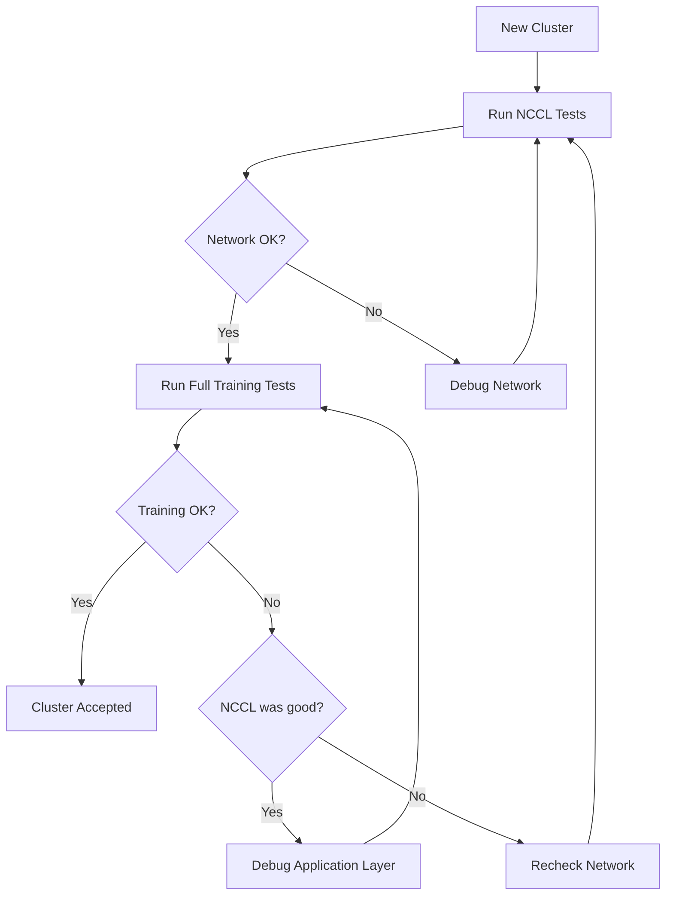

# Improvements Based on Nebius Soperator Analysis

This document provides a quick reference for the improvements made to our GPU cluster acceptance testing tool after analyzing the [Nebius Soperator test suite](https://github.com/nebius/nebius-solutions-library/tree/main/soperator/test).

## TL;DR - What Changed?

✅ **Added NCCL test binaries** to the container for direct bandwidth/latency measurement  
✅ **Created Slurm NCCL test script** following Soperator patterns (tests NVLink + InfiniBand)  
✅ **Wrote comprehensive NCCL testing guide** explaining when to use each test type  
✅ **Updated README** with quick-start NCCL testing examples  
✅ **Maintained backward compatibility** - all changes are additive  

## What You Can Do Now (That You Couldn't Before)

### 1. Quick NCCL Bandwidth Check (2-5 minutes)

```bash
# Test NVLink bandwidth on single node
docker run --gpus all --rm --ipc=host \
  cr.eu-north1.nebius.cloud/e00tnz9wpyxva2s992/gpu_cluster_testing:latest \
  bash -c "cd /workspace/nccl-tests && mpirun --allow-run-as-root -np 8 ./build/all_reduce_perf -b 8K -e 8G -f 2 -g 1"
```

**Expected**: 400-450 GB/s for H100 with NVLink

### 2. Test InfiniBand Configuration

```bash
# Force InfiniBand usage (disable NVLink)
docker run --gpus all --rm --ipc=host --network=host \
  -e NCCL_P2P_DISABLE=1 -e NCCL_SHM_DISABLE=1 -e NCCL_ALGO=Ring \
  cr.eu-north1.nebius.cloud/e00tnz9wpyxva2s992/gpu_cluster_testing:latest \
  bash -c "cd /workspace/nccl-tests && mpirun --allow-run-as-root -np 8 ./build/all_reduce_perf -b 8K -e 8G -f 2 -g 1"
```

**Expected**: 200-240 GB/s for HDR InfiniBand

### 3. Run Soperator-Style Test Suite on Slurm

```bash
sbatch examples/slurm-nccl-test.sh
tail -f results/nccl_bandwidth_*.out
```

This runs 4 tests automatically:
1. NVLink performance (single node)
2. InfiniBand performance (forced IB)
3. Multi-node all-reduce
4. Latency measurement

## Two Testing Approaches

### Approach 1: NCCL Tests (NEW - Inspired by Soperator)

**When to use**: Quick network validation, debugging InfiniBand issues  
**Runtime**: 2-5 minutes  
**What it tests**: Raw NCCL bandwidth and latency  
**Tools**: `all_reduce_perf`, `all_reduce_perf_mpi`  

```bash
# Single node
sbatch examples/slurm-nccl-test.sh

# Multi-node
srun --nodes=4 --ntasks-per-node=8 --gpus-per-node=8 --mpi=pmix \
  --container-image=cr.eu-north1.nebius.cloud/e00tnz9wpyxva2s992/gpu_cluster_testing:latest \
  bash -c 'cd /workspace/nccl-tests && ./build/all_reduce_perf_mpi -b 512M -e 8G -f 2 -g 1'
```

### Approach 2: Full Training Tests (Original Tool)

**When to use**: Comprehensive acceptance testing, production readiness validation  
**Runtime**: 10-30 minutes  
**What it tests**: Complete ML stack (training, data loading, checkpointing)  
**Tools**: PyTorch DDP with ResNet-50 or Transformer  

```bash
# Single node
sbatch examples/slurm-single-node.sbatch

# Multi-node
sbatch examples/slurm-multi-node.sbatch
```

## Recommended Workflow



**Steps**:
1. **Quick validation** (5 min): Run NCCL tests to verify network
2. **Comprehensive validation** (20 min): Run full training tests
3. **Analysis**:
   - If NCCL good + Training good → ✅ Accept cluster
   - If NCCL good + Training bad → Application issue
   - If NCCL bad → Infrastructure issue

## Key Soperator Patterns We Adopted

### 1. Test Both NVLink and InfiniBand Separately

```bash
# Default: Uses NVLink
all_reduce_perf -b 512M -e 8G -f 2 -g 8

# Forced: Uses InfiniBand
NCCL_P2P_DISABLE=1 NCCL_SHM_DISABLE=1 NCCL_ALGO=Ring \
all_reduce_perf -b 512M -e 8G -f 2 -g 8
```

This helps identify which communication path has issues.

### 2. Use MPI for Multi-Node NCCL Tests

```bash
srun --mpi=pmix all_reduce_perf_mpi -b 512M -e 8G -f 2 -g 1
```

Proper rank initialization and coordination for multi-node tests.

### 3. Sweep Message Sizes

```bash
all_reduce_perf -b 8K -e 8G -f 2 -g 1
```

- Small (8K-1M): Latency and protocol overhead
- Medium (1M-100M): Bandwidth and buffer management
- Large (100M-8G): Peak sustained bandwidth

## What We Chose NOT to Adopt

### ❌ SSH-Based Deployment

**Soperator**: Uses `deliver.sh` to upload tests via SSH  
**Us**: Container registry (more portable, easier versioning)

### ❌ Slurm-Only Focus

**Soperator**: Tests are Slurm-specific  
**Us**: Universal (Kubernetes, Slurm, bare metal)

### ❌ Pure NCCL Testing

**Soperator**: Only NCCL bandwidth tests  
**Us**: NCCL tests + full training tests (comprehensive validation)

## Files Added/Modified

| File | Status | Description |
|------|--------|-------------|
| `Dockerfile` | Modified | Added NCCL test build |
| `examples/slurm-nccl-test.sh` | New | Soperator-style NCCL test script |
| `docs/NCCL_TESTING.md` | New | Comprehensive NCCL testing guide |
| `docs/Exercise 2 Summary.md` | New | Detailed Soperator analysis |
| `docs/IMPROVEMENTS_FROM_SOPERATOR.md` | New | This file |
| `README.md` | Modified | Added NCCL testing section |

## Performance Expectations

### NCCL Test Results

| Hardware | NVLink Bandwidth | InfiniBand Bandwidth | Latency |
|----------|------------------|----------------------|---------|
| H100 SXM | 450-490 GB/s | 220-240 GB/s | 20-30 μs |
| H100 PCIe | 400-450 GB/s | 200-220 GB/s | 25-35 μs |
| A100 SXM | 300-330 GB/s | 180-200 GB/s | 25-40 μs |

### Full Training Results

| Configuration | Model | Batch/GPU | Throughput |
|---------------|-------|-----------|------------|
| 8x H100 | ResNet-50 | 64 | ~14,000 samples/sec |
| 32x H100 | ResNet-50 | 64 | ~50,000 samples/sec |
| 8x H100 | Transformer | 32 | ~8,000 samples/sec |

## Quick Troubleshooting

### If NCCL Tests Show Low Bandwidth

1. Check InfiniBand status: `ibstat`
2. Verify RDMA modules: `lsmod | grep -E 'ib|rdma'`
3. Check GPU topology: `nvidia-smi topo -m`
4. Enable NCCL debug: `export NCCL_DEBUG=INFO`

### If Training is Slow But NCCL is Fast

1. Check data loading: `nvidia-smi dmon` (GPU util should be >90%)
2. Profile training: Look at step time breakdown
3. Verify batch size: Larger batches = better GPU utilization
4. Check for CPU bottlenecks: Monitor CPU usage

### If Both NCCL and Training are Slow

1. Network configuration issue
2. Run cluster verification: `./scripts/verify-k8s-gpu-cluster.sh`
3. Check for InfiniBand errors: `ibdiagnet`
4. Verify NCCL can use InfiniBand: `NCCL_DEBUG=INFO`

## Further Reading

- **[NCCL Testing Guide](NCCL_TESTING.md)** - Complete NCCL testing documentation
- **[Exercise 2 Summary](Exercise%202%20Summary.md)** - Detailed Soperator analysis
- **[Acceptance Playbook](ACCEPTANCE_PLAYBOOK.md)** - Full benchmarks and troubleshooting
- **[Nebius Registry Guide](NEBIUS_REGISTRY_GUIDE.md)** - Container registry usage

## Summary

We've successfully **combined the best of both approaches**:

✅ **Soperator's speed** - Quick NCCL tests for rapid network validation  
✅ **Our comprehensiveness** - Full training tests for realistic acceptance  
✅ **Universal compatibility** - Works everywhere (K8s, Slurm, bare metal)  
✅ **Complete documentation** - Clear guidance on when to use each approach  

The tool now provides **defense in depth** for GPU cluster acceptance testing.
